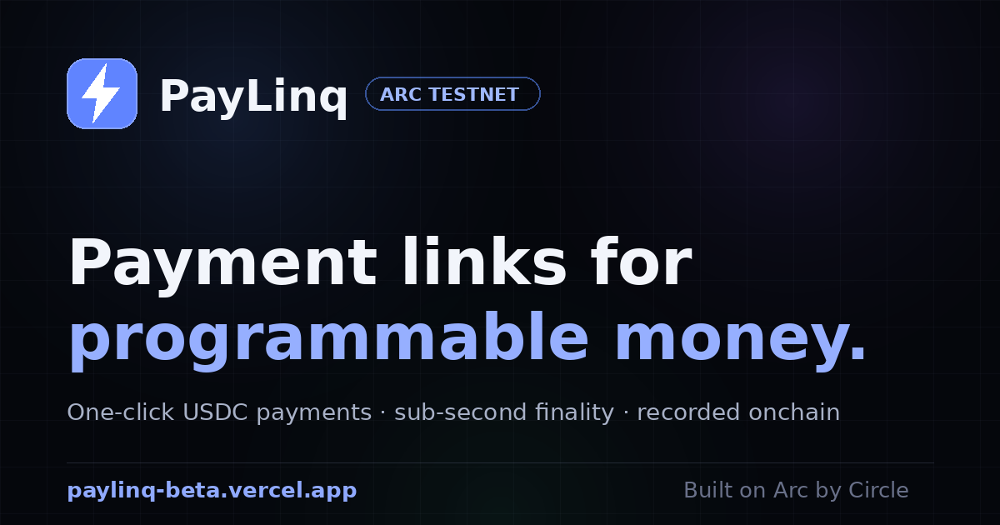

# ⚡ PayLinq — USDC Payment Links on Arc

**Create a payment link. Share it anywhere. Get paid in USDC in under a second.**

PayLinq is a dApp built on [Arc](https://docs.arc.io) — Circle's Layer-1 blockchain for programmable money — that lets anyone create shareable USDC payment links and invoices. The payer opens the link, clicks once, and the payment settles onchain with sub-second finality, recorded permanently by a verified Router contract.

🔗 **Live demo:** https://paylinq-beta.vercel.app
📜 **Router contract (verified):** [`0x8e9367…D3Bb1`](https://testnet.arcscan.app/address/0x8e9367F710684EaB28258dbeddd39330eAFD3Bb1)



---

## ✨ Features

- **Payment links + QR codes** — enter an address, amount and memo; get a shareable link and QR instantly. Invoice data is encoded in the URL, so there's nothing to store.
- **One-click pay** — the payer connects a wallet and pays in a single click. Arc Testnet is added to the wallet automatically.
- **Pay in-page or share** — pay an invoice right on the create screen without opening a new tab, or send the link/QR to someone else.
- **Onchain by design** — every payment is routed through the `PayLinqRouter` contract, which forwards funds atomically and emits a `PaymentSent` event recording payer, recipient, amount and invoice memo.
- **Shareable onchain receipts** — every payment produces a verifiable receipt page (`?receipt=<txhash>`) reconstructed from contract events — proof that can't be faked.
- **Invoice status detection** — opening an already-paid link shows an "already paid onchain" banner that links straight to the receipt.
- **Merchant dashboard** — connect a wallet to see total USDC received, payment count, and every incoming payment, read live from the contract.
- **Public onchain traction** — the homepage shows `totalPayments` and `totalVolume` counters straight from the contract.
- **Multi-wallet support (EIP-6963)** — detects every installed wallet (MetaMask, OKX, Rabby…) and lets the user choose, instead of whichever one grabs the page.
- **Light / dark mode** — a polished light theme by default, one-click toggle to dark, remembered across visits.
- **Zero backend** — the entire app is a single static HTML file. No server, no database, no signup.

## 🏗 How it works

```
Merchant                    Payer                        Arc (onchain)
   │                          │                              │
   │ 1. Create link           │                              │
   │    (to, amount, memo      │                              │
   │     encoded in URL)      │                              │
   │ ────── share link ─────▶ │                              │
   │                          │ 2. Open link, click Pay      │
   │                          │ ──── pay(recipient, memo) ──▶│
   │                          │      + native USDC value     │
   │                          │                              │ 3. PayLinqRouter forwards
   │                          │                              │    USDC to recipient &
   │                          │                              │    emits PaymentSent event
   │ ◀──────── USDC settles to merchant wallet (<1s) ────────│
   │                          │                              │
   │ 4. Dashboard & receipts read PaymentSent events back ───│
```

## 📜 Smart contract

| | |
|---|---|
| Contract | `PayLinqRouter` — [source](./PayLinqRouter.sol) |
| Address (Arc Testnet) | [`0x8e9367F710684EaB28258dbeddd39330eAFD3Bb1`](https://testnet.arcscan.app/address/0x8e9367F710684EaB28258dbeddd39330eAFD3Bb1) ✅ verified |
| Example payment | [tx on ArcScan](https://testnet.arcscan.app/tx/0x9622ad03c8fb50426e12a90bbcb1e6b7646f8f3ddb4d4ae4c65b6ae9f9c1bbd5) |

The router is intentionally minimal and trustless:

- `pay(address recipient, string memo)` — forwards the attached native USDC to the recipient **atomically** and emits a `PaymentSent` event. The contract **never holds funds**, has **no owner**, and **no special privileges**.
- `totalPayments` / `totalVolume` — public counters anyone can verify.
- Reverts on zero amount, zero address, self-payment, and failed transfers.

## ⚙️ Network

| | |
|---|---|
| Network | Arc Testnet |
| Chain ID | `5042002` |
| RPC | `https://rpc.testnet.arc.network` |
| Gas token | USDC (native) |
| Explorer | [testnet.arcscan.app](https://testnet.arcscan.app) |
| Faucet | [faucet.circle.com](https://faucet.circle.com) |

> On Arc, USDC is the **native gas token**: native value uses 18 decimals, while the optional ERC-20 interface at `0x3600…0000` uses 6 decimals. PayLinq routes payments as native value and reads balances via the ERC-20 interface, per Arc docs recommendations.

## 🚀 Try it

1. Install [MetaMask](https://metamask.io/download/) (or any EIP-6963 wallet)
2. Get free testnet USDC from the [Circle Faucet](https://faucet.circle.com) (select **Arc Testnet**)
3. Open the [live demo](https://paylinq-beta.vercel.app) → create a link → pay it from another account → view the onchain receipt

## 🛠 Tech stack

Single-file static frontend (`index.html`) — vanilla JS + [ethers v6](https://docs.ethers.org/v6/), no build step. EIP-6963 for multi-wallet discovery. Solidity 0.8 router contract deployed via Remix, verified on ArcScan. Dashboard and receipts read contract events through the ArcScan API. Hosted on Vercel.

## 🗺 Roadmap

- [x] Payment links + QR codes
- [x] Router contract with onchain payment records
- [x] Pay in-page (no redirect) + shareable payment links
- [x] "Already paid" detection from contract events
- [x] Live onchain stats
- [x] Merchant dashboard (all received payments, read from events)
- [x] Shareable onchain receipts
- [x] Multi-wallet support (EIP-6963) + light/dark mode
- [ ] EURC support
- [ ] Mainnet deployment when Arc mainnet launches

## 📄 License

MIT
